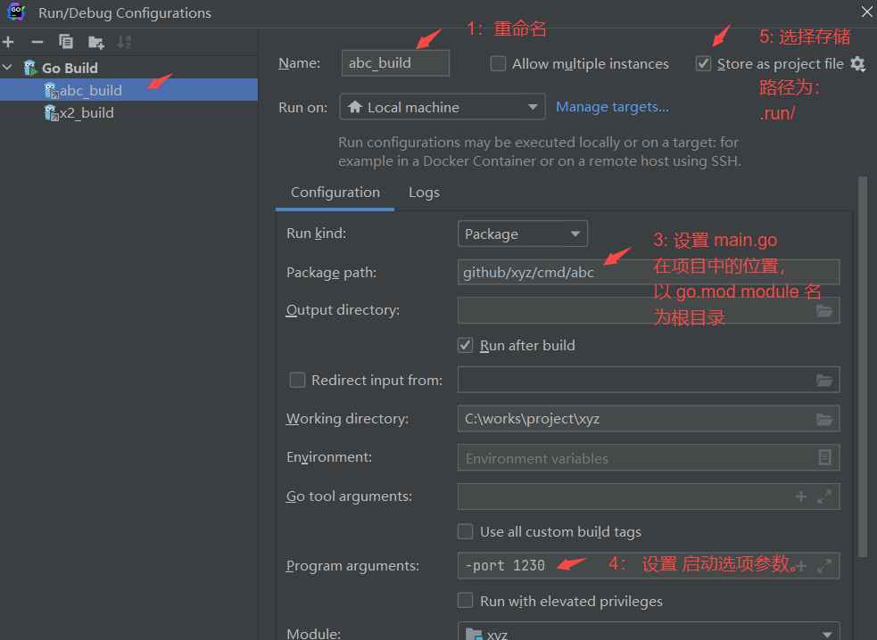
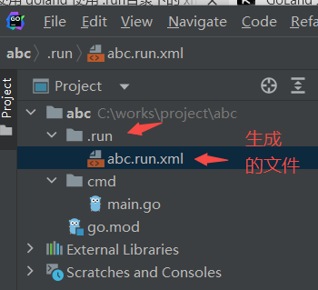
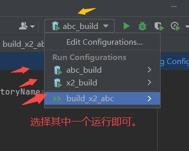
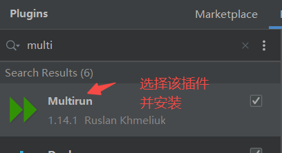
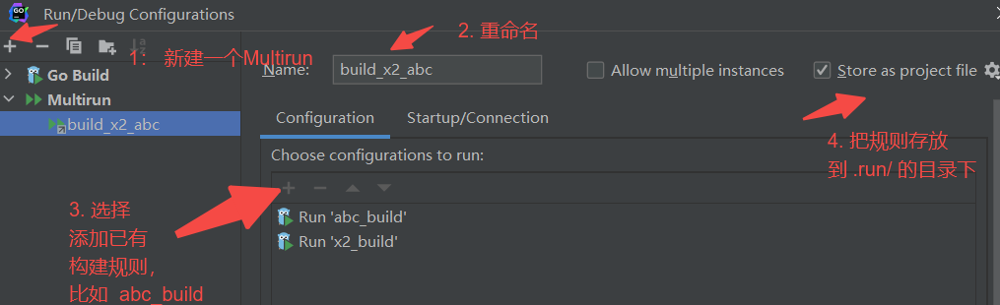
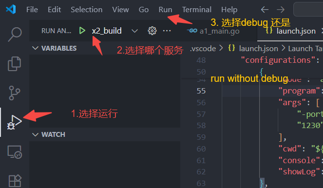

## 在goland 中配置 文件，实现项目启动依赖项自动加载

* 在xyz项目中配置程序启动依赖项
 

* 生成的文件格式：

* 后续其他地方运行该项目时，直接会自动加载。运行即可:

### 如何选择多个同时运行

*下载插件：

* 配置多个服务：

## vscode 中配置，实现服务启动依赖项自动加载

* 在xyz 项目中配置服务启动依赖项：
在 .vscode/launch.json文件中新增内容，如xyz/.vscode/launch.json 描述。
*启动服务：

