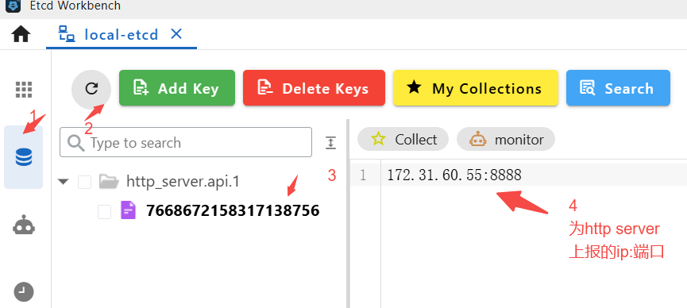

## 介绍 go-zero http call rpc by etcd

### etcd 本地安装和管理端界面安装

* etcd docker-compose 环境安装

```
进入 etcd_install/  运行 docker-compose up -d

```

* 安装 etcd管理端软件： Etcd Workbench

### 启动一个Http server,带有 etcd注册机制

* 使用go-zero第三方一个扩展：
<https://github.com/zeromicro/zero-contrib/blob/main/rest/registry/etcd/README.md>

修改配置文件，增加向etcd的注册, 修改 etc/httpserveretcd-api.yaml， 增加注册的etcd配置

```
RegisterEtcd:
  Hosts:
    - 127.0.0.1:2379
  Key: http_server.api.1

```

修改 配置文件代码，修改文件 config/config.go

```
type Config struct {
 rest.RestConf
 // 新增 http server 自身节点向etcd上报的etcd节点配置：
 RegisterEtcd discov.EtcdConf
}
```

启动 http 服务， 在etcd的管理端界面查看 上报的节点信息：


### 创建多个 rpc服务，并注册到 etcd上

* 使用命令创建默认 rpc

```
goctl rpc new rpc_server_etcd

```

* 修改配置文件： etc/rpcserveretcd.yaml 文件, 配置etcd信息和自己注册信息

```
Name: rpcserveretcd.rpc
ListenOn: 0.0.0.0:8080

## 向etcd 注册自己的身份 key
Etcd:
  Hosts:
  - 127.0.0.1:2379
  Key: rpc_etcd1.rpc.1  ## 向etcd 注册自己的身份 key
```

* 修改业务逻辑，修改文件： internal/logic/pinglogic.go

```
func (l *PingLogic) Ping(in *rpc_server_etcd.Request) (*rpc_server_etcd.Response, error) {
 // todo: add your logic here and delete this line

 return &rpc_server_etcd.Response{
  Pong: "this is message pong.",
 }, nil
}
```

* 启动rpc 服务，查看etcd中是否有 etc/*.yaml 中配置的 etcd key

* 修改调用方 http 配置，增加 调用client 的etc配置， 修改 etc/下文件：

```
## 访问rpc 的client配置
ClientEtcd:
  Etcd:  ## 使用的etcd,从中获取服务端的节点信息
    Hosts:  ## 这是etcd 的节点
      - 127.0.0.1:2379
    Key: rpc_etcd1.rpc.1  ## 对端服务在etcd上注册key 
```

* 修改 配置文件源码，修改 config/config.go

```
type Config struct {
  rest.RestConf
  // 新增 http server 自身节点向etcd上报的etcd节点配置：
  RegisterEtcd discov.EtcdConf

  // 新增访问rpc服务的client配置；目前采用etcd方式
  ClientEtcd zrpc.RpcClientConf
}
```

* 增加 rpc cliet的创建流程， svc/servicecontext.go 修改文件：

```
type ServiceContext struct {
 Config config.Config

 // 增加访问rpc的 client
 RpcClient pb.RpcServerEtcdClient
}

func NewServiceContext(c config.Config) *ServiceContext {
 // 创建一个连接
 conn := zrpc.MustNewClient(c.ClientEtcd)

 return &ServiceContext{
  Config: c,
  // 初始化 rpc client 对象
  RpcClient: pb.NewRpcServerEtcdClient(
   conn.Conn(),
  ),
 }
}
```

* 在http 主业务流程中调用下游服务， 修改文件 logic/httpserveretcdlogic.go

```
func (l *Http_server_etcdLogic) Http_server_etcd(req *types.Request) (resp *types.Response, err error) {
 // todo: add your logic here and delete this line

 //通过 rpc client 调用下游服务
 rpcReq := &pb.Request{
  Ping: fmt.Sprintf("from http req: %v", req.Name),
 }

 ret, err := l.svcCtx.RpcClient.Ping(l.ctx, rpcReq)
 if err != nil {
  return nil, err
 }
 resp = &types.Response{
  Message: fmt.Sprintf("from rpc response: %v", ret.Pong),
 }
 return
}

```

* 分别启动http server

* 用户调用接口： <http://172.31.60.55:8888/from/you>
