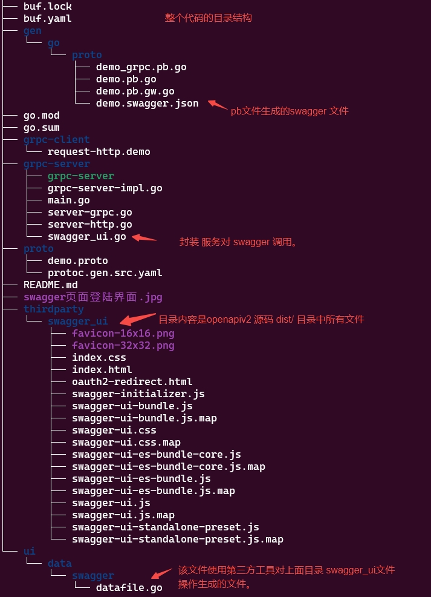
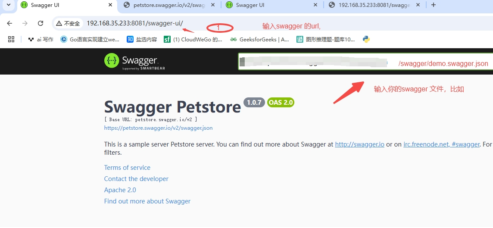

*  option (google.api.http) = {} 使用的场景:
*  上面字段使用在 pb文件的service{}中， 他是一个特定于 gRPC 和 gRPC 网关（grpc-gateway） 的扩展选项。选项用于将 gRPC 服务映射到 HTTP/JSON 接口的高级功能。用于将 gRPC 方法映射到 HTTP RESTful 接口。这使得开发者可以通过 HTTP 请求访问 gRPC 服务，从而在不支持 gRPC 的客户端（如浏览器）中也能使用 gRPC 定义的服务。
* 文档1：https://github.com/grpc-ecosystem/grpc-gateway/
* 文档2： https://grpc-ecosystem.github.io/grpc-gateway/

* 安装依赖包：
* go get -u -v  github.com/grpc-ecosystem/grpc-gateway/v2/protoc-gen-grpc-gateway 
* go get -u -v github.com/grpc-ecosystem/grpc-gateway/v2/protoc-gen-openapiv2
* go get -u -v google.golang.org/protobuf/cmd/protoc-gen-go
* go get -u -v google.golang.org/grpc/cmd/protoc-gen-go-grpc

go install \
    github.com/grpc-ecosystem/grpc-gateway/v2/protoc-gen-grpc-gateway \
    github.com/grpc-ecosystem/grpc-gateway/v2/protoc-gen-openapiv2 \
    google.golang.org/protobuf/cmd/protoc-gen-go \
    google.golang.org/grpc/cmd/protoc-gen-go-grpc

* 设置 buf 依赖规则文件：创建 buf.yaml 和实际业务规则文件  protoc.gen.src.yaml ；buf.yaml要存放在项目根目录， protoc.gen.src.yaml 存放在实际业务的脚本目录中；运行 buf generate 时，通过 --template 选项指定。
  
* 编写proto文件。为了使用 grpc-gateway, 有三种选择，一般采用直接修改 proto文件，并设置注解，比如在proto文件中增加：import "google/api/annotations.proto"; 和 增加 option (google.api.http) 等；
  
* 根据proto文件生成源文件命令：在项目根目录中，运行命令：
  buf dep update
  buf generate --template proto/protoc.gen.src.yaml .


* [protoc-gen-openapiv2] 此插件还支持为未注释的方法生成 OpenAPI 定义；使用 generate_unbound_methods 选项启用此功能。
  
* 分别编写http 服务端和grpc服务端，可以在同一个进程里实现，也可在不同进程中实现。
* 如果在单进程实现 http/grpc server， 参考： server-grpc.go, server-http.go 来定义。
* 实现http、grpc 业务逻辑接口，参考：grpc-server-impl.go来实现

#
* 安装swagger 的必要插件：
*  安装 protoc-gen-openapiv2： 
*  go install github.com/grpc-ecosystem/grpc-gateway/v2/protoc-gen-openapiv2@latest
* 安装 go-bindata:
* go install -a -v github.com/go-bindata/go-bindata/v3/...@latest
* 安装 go-bindata-assetfs:
* go install github.com/elazarl/go-bindata-assetfs/...@latest
* 修改源码: 修改 pb 代码，比如修改 demo.proto源码：
 ```
 //增加插件引用：
 import "protoc-gen-openapiv2/options/annotations.proto";

 // 定义swagger内容
    option (grpc.gateway.protoc_gen_openapiv2.options.openapiv2_swagger) = {
      info: {
        title: "grpc gateway sample";
        version: "1.0";
      };
      schemes: HTTP;
    };
```

* 执行 buf dep updates 
* 执行 buf generate   --template  proto/protoc.gen.src.yaml
  
#
* 下载 swagger-ui 源码 git clone https://github.com/swagger-api/swagger-ui.git
并将 dist 目录下的文件copy 到 thirdparty/swagger_ui 目录中。
* 将swagger-ui源码转为datafile.go文件：
 go-bindata --nocompress -pkg swagger -o ui/data/swagger/datafile.go thirdparty/swagger_ui/...

* 生成 ui/data/swagger/目录下的 datafile.go
* 在源码中修改，集成 swagger_ui.go
* 代码结构如图所示：
  

* 获取api接口请求效果图:
  

    