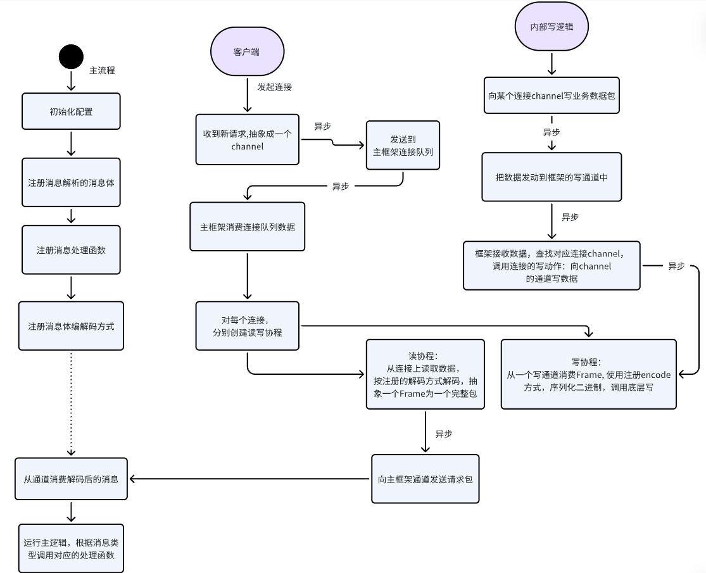

# 描述说明
##  1. 主要功能：
* 对外提供 私有协议（自定义包头和payload）解析，编码。其他比如 grpc， thrift 可参考其他开源代码。
* 对不同消息类型提供 灵活处理函数注入；不需要侵入框架内部。
* 支持 tcp/udp 底层协议的通信方式，包括 udp 面向连接和非链接模式。

## 2. 内部实现机制：

* 内部连接，读写等都是异步处理，不会阻塞当前的逻辑。