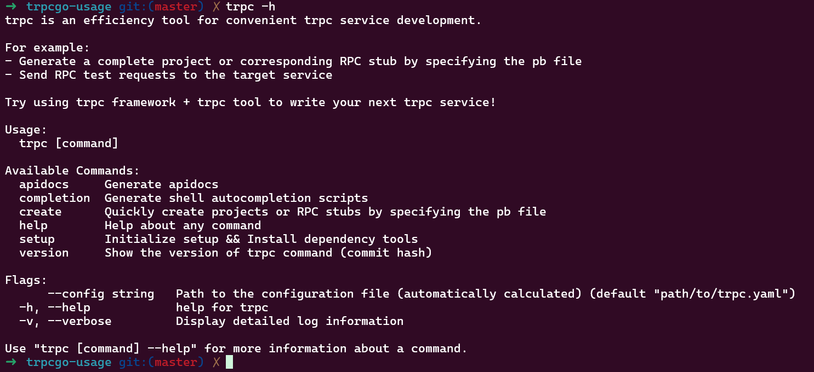

## trpc 文档

<https://github.com/trpc-group/trpc-go/blob/main/docs/README.zh_CN.md>

* 快速开始参考：
<https://github.com/trpc-group/trpc-go/blob/main/docs/quick_start.zh_CN.md>

## trpc 工具的安装

* 下面的示例是 trpc-client <----> trpc-server 的调用关系。
* trpc的特性参考文献： <https://github.com/trpc-group/trpc-go/tree/v1.0.3/examples/features>

* trpc-cmdline 工具： 用于生成 源码stub或者 生成项目，eg: <https://github.com/trpc-group/trpc-cmdline>
* 参考工具选项： <https://github.com/trpc-group/trpc-cmdline/blob/main/docs/README.zh_CN.md>
* 参考： <https://github.com/trpc-group/trpc-cmdline/blob/main/docs/examples/example-1/README.zh_CN.md>
* 参考： <https://github.com/trpc-group/trpc-cmdline/tree/main/testcase/create>
* 参考： http protocol, alias生效： <https://github.com/trpc-group/trpc-cmdline/blob/main/docs/examples/example-2/README.zh_CN.md>
* 工具自定义模板参考： <https://github.com/trpc-group/trpc-cmdline/blob/main/docs/README.zh_CN.md>

```
First, add the following into your ~/.gitconfig:

[url "ssh://git@github.com/"]
    insteadOf = https://github.com/
Then run the following to install trpc-cmdline:

go install trpc.group/trpc-go/trpc-cmdline/trpc@latest
```

工具选项：


* 安装依赖：

```
trpc setup
```

* 使用 protobuffer 文件来生成项目，比如项目proto文件：
* 参考 trpc-go example:
<https://github.com/trpc-group/trpc-go/tree/main/examples/helloworld>

```
syntax = "proto3";
package helloworld;

option go_package = "github.com/some-repo/examples/helloworld";

// HelloRequest is hello request.
message HelloRequest {
  string msg = 1;
}

// HelloResponse is hello response.
message HelloResponse {
  string msg = 1;
}

// HelloWorldService handles hello request and echo message.
service HelloWorldService {
  // Hello says hello.
  rpc Hello(HelloRequest) returns(HelloResponse);
}
```

* 使用上面proto文件产生一个完整的项目：

```
其中 -p 指定 proto 文件， -o 指示项目生成的目录，默认是和 pb文件时同一个级别的目录。
trpc create -p pb/helloworld.proto -o helloworld 
或者使用下面命令， -d 选项指定 proto文件的路径， -f 强制覆盖输出
trpc create -p helloworld.proto -d pb -o helloworld
```

运行服务器端服务：

```
go run .
```

运行客户端：

```
go run ./cmd/client/main.go
```

* 上面是产生一个完整的项目，现在只产生一个rpc 源码，还是之前根据helloworld.proto 文件。

```
trpc create -d pb -o rpc --rpconly
```

## 介绍 trpc-client 模块

* 客户端配置：
用户不仅可以在发起 RPC 请求时传入不同的选项，还可以在配置文件中添加客户端的配置。客户端选项和客户端配置的功能是部分重合的，客户端选项的优先级高于客户端配置，如果同时添加了配置和选项的话，选项中的内容会覆盖配置。使用客户端配置的优点是方便修改配置内容，不需要频繁变更代码。

* 参考： <https://github.com/trpc-group/trpc-go/blob/main/client/README.zh_CN.md>

* client的配置项：关注 callee, name 差别
* callee 是指被调方的 pb 协议文件的 service name，格式是 pbpackage.service。
* callee 指定被调用服务的元数据（扩展字段）；trpc 工具生成的 client proxy接口内部： 会根据pb定义的 package.service名字 在client 客户端配置文件中 找 callee 项，里面对应有name,protocal,time; 这样client 就知道如何去链接对方。
* 所以 callee 的核心作用是建立 “Protobuf 服务定义” 与 “客户端配置” 之间的映射关系。通过与 pb 中 service name 完全一致的 callee 值，框架能准确地为每个 client proxy 绑定对应的配置，保证客户端调用时使用正确的参数（如寻址目标、协议、超时等），避免不同服务的配置混淆。

* name 是指被调方注册在名字服务上的服务名，也就是被调服务配置文件里面的 server.service.name 的字段值，name 配置项：指定目标服务的唯一标识，用于定位具体的服务实例，用于客户端寻址访问服务端；使用场景：当客户端需要调用某个服务时，通过 name 匹配对应的服务配置，确定调用目标，寻址。

```
// 初始化客户端代理（内部会根据 pb service name 查找配置）
client := pbpackage.NewUserServiceClientProxy()

// 发起调用
resp, err := client.GetUser(ctx, req)

上面流程：识别到当前 client proxy 对应的 pb service name 是 pbpackage.UserService；
在配置文件中查找 callee: pbpackage.UserService 的配置项；
将该配置项中的参数（name、protocol、timeout 等）应用到本次调用中，确保调用使用正确的寻址信息和参数

```

* client的 target 配置项：

```
1. target 是用于指定服务调用目标地址的核心配置项，它直接决定了客户端请求的网络端点（即 “往哪里发请求”）

2. target 用于明确指定被调用服务的网络地址，格式为 协议://地址，框架会根据该配置直接将请求发送到对应的网络端点。它是客户端绕过服务发现机制、直接进行点对点调用的关键配置

3. target 的格式为 通信方式://具体地址，常见形式：
3.1 ip://127.0.0.1:8000：通过 IP + 端口直接调用（最常用）

3.2 unix:///tmp/trpc.sock：通过 Unix Domain Socket 调用（本地进程间通信）

3.3 dns://example.service.com:8000：通过 DNS 解析域名获取地址（较少直接使用，通常由服务发现接管）

4.TRPC 框架支持两种服务调用方式，target 对应其中一种：

4.1 无服务发现：通过 target 直接指定地址，请求会固定发送到该地址（如示例中的 ip://127.0.0.1:8000）；如果同时配置了 target 和服务发现相关配置，target 会优先生效，框架会忽略服务发现逻辑。

4.2 有服务发现：不配置 target，框架通过 name 从注册中心（如 Polaris、ETCD）获取服务实例列表，再通过负载均衡选择地址。

5.target 主要用于不需要服务发现的场景，典型例如：

5.1 开发 / 测试环境：本地调试时，直接指定服务的 IP:Port（如 127.0.0.1:8000），无需依赖注册中心。

5.2 固定地址的服务：某些内部服务地址固定不变（如基础设施服务），无需动态发现。

5.3 临时调试：临时绕过服务发现，直接调用某个特定实例排查问题（如验证某个节点是否正常）。

5.4 单实例部署：服务仅部署单个实例，无需负载均衡，直接指定地址即可。
```

* 客户端如何通过服务注册发现来连接服务：

```
1. 在客户端的配置文件中设置：

client:
  timeout: 1000ms
  service:
    - callee: trpc.test.helloworld.Greeter  # PB 中定义的服务名（匹配客户端代理）
      name: trpc.test.helloworld.Greeter    # 注册中心中的服务名（服务发现的关键）
      discovery: polaris                    # 使用北极星作为服务发现插件
      loadbalance: round_robin              # 负载均衡策略：轮询
      protocol: trpc                        # 通信协议
      timeout: 500ms                        # 调用超时
###介绍：
框架会根据 name 从注册中心查询 trpc.test.helloworld.Greeter 对应的所有可用实例，再通过 loadbalance 策略选择一个实例发起调用

根据上面配置，client 调用 ：
// 1. 方式一：默认读取配置文件中的服务发现配置
  clientProxy := pb.NewHelloWorldServiceClientProxy()


2. 通过客户端代码初始化实现服务发现：
如果需要在代码中动态修改服务发现相关参数（如临时切换服务名、负载均衡策略），可通过 client.Options 实现。

// 2. 方式二：代码中动态指定服务发现参数（覆盖配置文件）
  opts := []client.Option{
    client.WithServiceName("trpc.test.helloworld.Greeter"), // 服务名（对应配置中的 name）
    client.WithDiscovery("polaris"),                        // 服务发现插件
    client.WithLoadBalance("round_robin"),                  // 负载均衡策略
    client.WithTimeout(500),                                // 超时时间(ms)
  }
  clientProxyWithOpts := pb.NewHelloWorldServiceClientProxy(opts...)

```

## trpc 配置详解

* 描述：  <https://github.com/trpc-group/trpc-go/blob/main/docs/user_guide/framework_conf.zh_CN.md>
* 配置实例： <https://github.com/trpc-group/trpc-go/blob/main/testdata/trpc_go.yaml>

## 客户端/服务端 过滤器 filter

* 代码自定义过滤器 和 配置文件中配置过滤器
* 客户端定义自定义过滤器:

```
func MyFilter(ctx context.Context, req, rsp interface{}, next ClientHandleFunc) error {
 // 前置流程
 err := next(ctx, req, rsp)
 // 后置流程
 return err
}
```

再通过 client.WithFilters(MyFilter) 注册到 客户端中。
参考： <https://github.com/trpc-group/trpc-go/blob/main/examples/features/filter/client/main.go>

* 服务端定义自定义过滤器：

```
type ServerFilter func(ctx context.Context, req interface{}, next ServerHandleFunc) (rsp interface{}, err error)
type ServerHandleFunc func(ctx context.Context, req interface{}) (rsp interface{}, err error)
```

然后通过 server.WithFilters(自定义的服务端过滤器) 注册到框架中。参考： <https://github.com/trpc-group/trpc-go/blob/main/examples/features/filter/server/main.go>

上面是代码实现的过滤器；当代码和配置文件同时存在时，代码指定的拦截器会先执行，然后再执行配置文件指定的拦截器。

## 插件介绍

* 插件的作用： 插件是 tRPC-Go 基于 yaml 配置文件设计的一套自动化模块加载机制。
接口定义如下：

```
package plugin

type Factory interface {
 Type() string
 Setup(name string, dec Decoder) error
}

type Decoder interface {
 Decode(cfg interface{}) error
}
```

其中：Type 返回插件的类型，Setup 时会传入插件名和一个 Decoder，用于解析 yaml 的内容。yaml 来自 trpc_go.yaml 配置：

```
plugins:
  __type:
    __name:
      # plugin contents
```

其中 __type 应替换为 Factory.Type() 返回的值，__name 应替换为 plugin.Register 的第一个参数。

在实现 plugin 时，你应该创建一个 func init() 函数，通过 Register 注册你的插件。这样别人用你的插件时，只需要在代码中匿名 import 你的包即可。当调用 trpc.NewServer() 时，插件就会调用 Factory.Setup 函数进行初始化。

插件经常和拦截器配合，比如在 Factory.Setup 函数中调用 filter.Register 注册拦截器。框架保证插件初始化在拦截器加载之前完成。这样，你就可以通过修改 trpc_go.yaml 来配置拦截器的行为. 参考： <https://github.com/trpc-group/trpc-go/blob/bbfd46a69805ce14c3cbb4c439083fc12f8f20d8/examples/features/plugin/README.md>

* plugin中加载filter：配置中 plugins 用来给插件传配置参数，插件启动时会执行 Setup() 并拿到这些参数。
filter: 用来指定在请求链路中启用哪些拦截器（顺序生效）。
有的插件不需要 filter（比如日志），有的插件既有配置（plugins）又要挂在链路上（filter）。

## trpc-go 中 proto 文件中 提供 对外提供 Http 能力

* 在 pb 文件定义的 rpc 接口 后加上 类似： // @alias=/demo/Hello  
生成的 类似：

```
var HelloWorldServer_ServiceDesc = server.ServiceDesc{
 ServiceName: "demo.simplest.HelloWorld",
 HandlerType: ((*HelloWorldService)(nil)),
 Methods: []server.Method{
  {
   Name: "/demo/Hello",
   Func: HelloWorldService_Hello_Handler,
  },
  {
   Name: "/demo.simplest.HelloWorld/Hello",
   Func: HelloWorldService_Hello_Handler,
  },
 },
}

```
